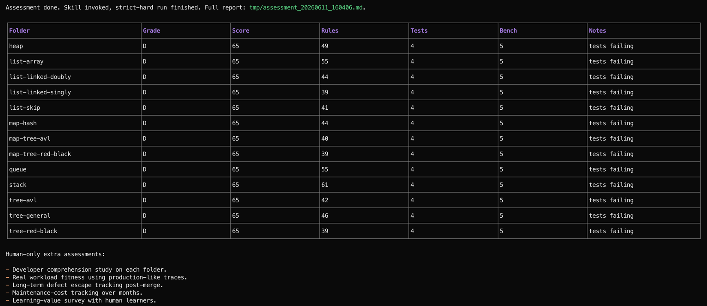

# Data Structures in Golang

Personal learning repository for coding data structures in Go (Golang).

## Purpose

This codebase is for personal practice and exploration of data structure implementations in Golang.

## Data Structures Explored

Data structures being explored correspond to top-level folders in this repository:

- `map-hash/` - Hash map (open addressing and linear probing)
- `map-tree-avl/` - Ordered map implemented with AVL tree
- `map-tree-red-black/` - Ordered map implemented with red-black tree
- `heap/` - Heap data structure
- `list-array/` - Array list (dynamic-array style list)
- `list-linked-singly/` - Singly linked list data structure
- `list-linked-doubly/` - Doubly linked list data structure
- `list-skip/` - Skip list data structure
- `queue/` - Queue data structure
- `stack/` - Stack data structure
- `tree-general/` - General tree (n-ary tree)
- `tree-avl/` - AVL tree (self-balancing binary search tree, set-like)
- `tree-red-black/` - Red-black tree (self-balancing binary search tree, set-like)

## Notes

This is an evolving learning project; folder contents may change over time as implementations are added and refined.

## Contracts and Guidance

- Cross-folder contract summary: `STRUCTURE-CONTRACTS.md`
- Agent working rules: `AGENTS.md`
- Per-structure implementation rules: each folder `RULES.md`
- Manual AI skill for grading implementations: `.agents/skills/assess-implementation/SKILL.md`

## AI Assessment Skill

Use `.agents/skills/assess-implementation/SKILL.md` to harshly grade each data structure implementation against repo rules and folder contracts.
The skill is designed for manual use across AI agents and requires the assessment result to be shown as a markdown table in terminal and saved as a markdown report under `tmp/`.

**Example Output**:

